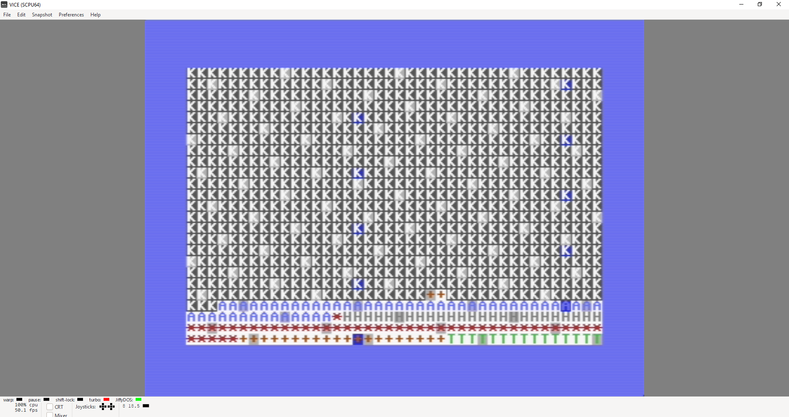
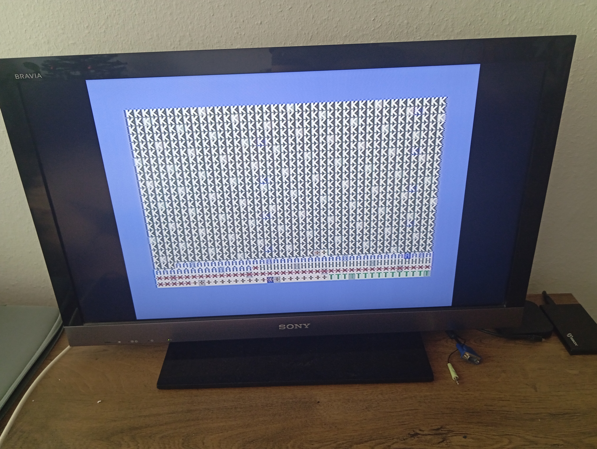

# Mit rákentek a századok (BME VIK GTB 2024 előfeladat)

Screenshotok VICE-ból és képek a C64C-ről (VICE azért kellett, mert a C64-en rosszul látszanak a színek).  
A `crunchy.py` egy BASIC "preprocesszor", ami `&label&` támogatást ad a BASIC-hez és automatikusan beszámozza a sorokat. Mind a valódi, mind az emulált hardware-en az `osszekenocs.prg` file tartalmát futtatattam le, amit `crunchy`-val generáltam a `kenocs.prg`-ből.  

### Évek indoklásai:

#### Betűk
A képernyőn 1025-től 2024-ig szerepelnek az évek.
- ***Fehér K*** 1025-1847 és 1850-1867-ig: 1848. március 17-én (július 1. előtt) létrejött a független, felelős kormány és a harcolók 1849. augusztus 13-án (július 1. után) tették le a fegyvert. Az első kiegyezési törvényt (1867. évi XII. tvc.) 1867. május 29-én fogadták el, innentől alkotmányos monarchiának tekinthető az államforma.
- ***Kék A*** 18*67-19*18-ig: Az Osztrák-Magyar Monarchia 1918 októbere körül bomlott fel.
- ***Szürke H*** 1920-1944-ig: 1920-tól Horthy Miklós kormányzósága alatt király nélküli krályság lett az államforma. 1944-1945-ben nehéz államformát megállapítani, mert az keleten szovjet megszállás volt, nyugaton pedig nyilas-diktatúra.
- ***Narancs +*** 1848-49-ben, 1946-48 között, 1990-2010-ig: Az 1946-os köztársaság a szovjet megszállás miatt megkérdőjelezhető.
- ***Vörös csillag*** 1919-ben és 1948-1989-ig: A Tanácsköztársaság 130 napig létezett ugyan, de ebbe július 1. is beletartozott. A Harmadik Magyar Köztársaságot 1989. október 23-án hirdette ki Szűrös Mátyás.
- ***Zöld T*** 2010-től napjainkig: A 2010-es országgyűlési választások 2. fordulóját április 25-én tartották.

#### Háttér
- **Kék, világosszürke, sötétszürke**: triviálisan
- **Fehér**: A dualizmustól kezdve minden rendszerben tartottak országgyűlési választásokat.

||
|---|
|Emulátor, ahol a színek látszanak (_nagyjából_)|

||
|---|
|Hardware, ahol a színek _nem_ látszanak|
