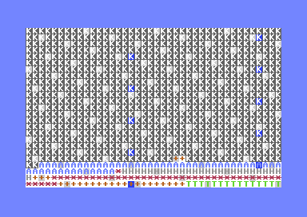
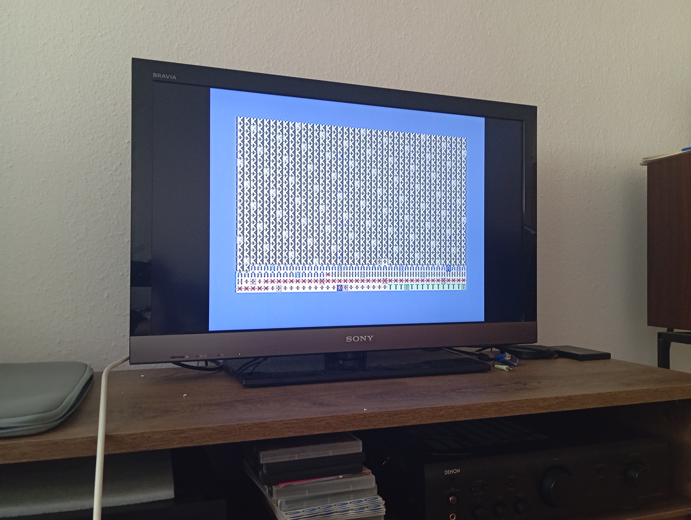

# Mit rákentek a századok (BME VIK GTB 2024 előfeladat)

Screenshotok VICE-ból és képek a C64C-ről (VICE azért kellett, mert a C64-en rosszul látszanak a színek).  
A `crunchy.py` egy BASIC "preprocesszora", `&label&` támogatást ad a BASIC-hez és automatikusan létrehozza a sorszámokat. Mind a valódi, mind az emulált hardware-en az `osszekenocs.prg` file
tartalmát futtatattam le, amit `crunchy`-val generáltam a `kenocs.prg`-ből.
||
|---|
|Emulátor, ahol a színek látszanak|

||
|---|
|Hardware, ahol a színek _nem_ látszanak|